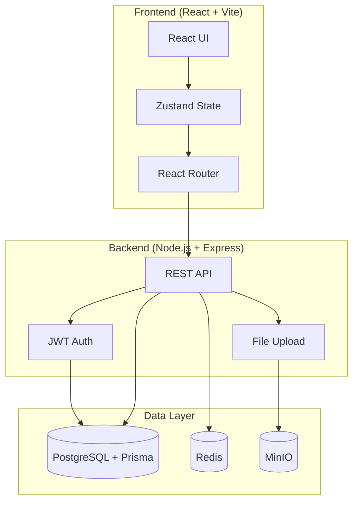
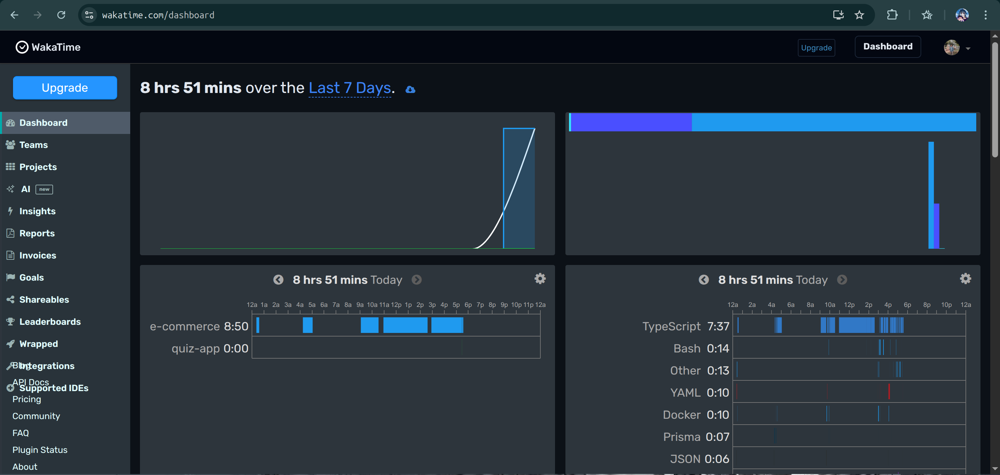
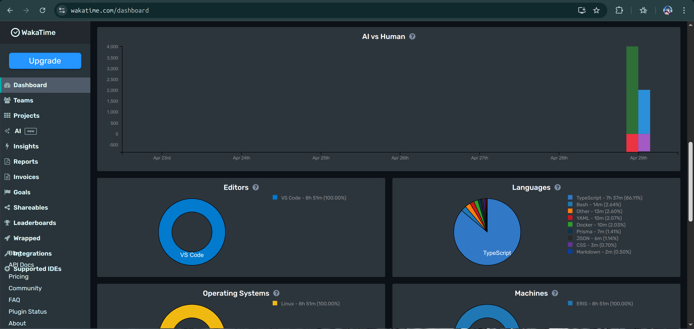

# GDGShopzy

> A modern e-commerce platform with multi-role support (Buyer, Seller, Employee)

## 📖 About

GDGShopzy is a full-stack e-commerce application built with modern web technologies. It features a comprehensive multi-role system supporting Buyers, Sellers, and Employees, each with tailored functionalities. The platform includes product management, shopping cart, order processing, secure authentication, and file storage capabilities.

**Key Features:**

- 🛒 Complete shopping cart and checkout flow
- 👥 Multi-role authentication (Buyer, Seller, Employee)
- 📦 Product catalog with image uploads
- 🔐 JWT-based secure authentication
- 💳 Order management and tracking
- 📊 Redis caching for performance
- 🗄️ MinIO object storage for media files

## 🏗️ Architecture



## 🛠️ Tech Stack

[](https://skillicons.dev)


## 🚀 Getting Started

### Prerequisites

- Node.js >= 20.0.0
- npm >= 10.0.0
- Docker & Docker Compose

### Development

```bash
# Install dependencies
npm install

# Start development environment
npm run docker:dev

# Run client & server
npm run dev
```

### Production

```bash
# Build all apps
npm run build

# Deploy with Docker
npm run docker:prod:build
```

## 📊 WakaTime Stats

### Development Time Breakdown

<div align="center">
  
</div>

<div align="center">
  
</div>

## 📝 License

This project is licensed under the MIT License.
